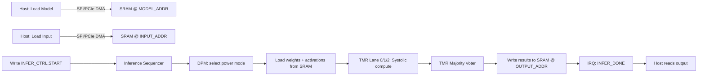
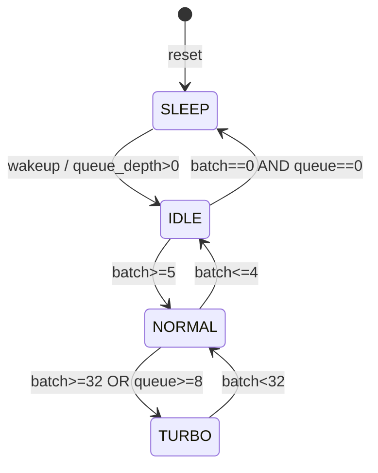

# SAD — System Architecture Document
# Mili BNN-TMR Edge AI Accelerator

**Version:** 0.1.0  
**Date:** 2026-07-11  
**Status:** Phase 1 Draft

---

## 1. Overview

The Mili BNN-TMR chip is a 14nm ASIC edge AI accelerator for binary neural network (BNN) inference with triple modular redundancy (TMR) for SEU fault tolerance. It integrates with an STM32H7 host via PCIe Gen4 or SPI.

| Parameter | Value |
|-----------|-------|
| PE Array | 8×8 (64 PEs) |
| SRAM | 32 MB with ECC |
| Memory Bandwidth | 256 bit/cycle |
| Base Frequency | 400 MHz (up to 800 MHz Turbo) |
| Max Power | < 50 W |
| Package | BGA-484 |

---

## 2. Block Diagram

```
┌─────────────────────────────────────────────────────────────────────────────┐
│                           MILI BNN-TMR CHIP TOP                             │
│                                                                             │
│  ┌──────────┐  ┌──────────┐  ┌──────────┐  ┌──────────┐                   │
│  │ PCIe Gen4│  │   SPI    │  │   I2C    │  │   UART   │   Host I/F       │
│  │   IF     │  │   IF     │  │   IF     │  │   IF     │                   │
│  └────┬─────┘  └────┬─────┘  └────┬─────┘  └────┬─────┘                   │
│       └──────────────┴─────────────┴──────────────┘                         │
│                              │ AXI-Lite / APB                               │
│                    ┌─────────▼─────────┐                                    │
│                    │    Register File   │  CSR 0x4000_0000                 │
│                    │  (mili_regs.h)     │                                    │
│                    └─────────┬─────────┘                                    │
│                              │                                              │
│         ┌────────────────────┼────────────────────┐                         │
│         │                    │                    │                         │
│  ┌──────▼──────┐    ┌───────▼───────┐    ┌──────▼──────┐                   │
│  │  DPM Ctrl   │    │  Inference    │    │  IRQ / DMA  │                   │
│  │  DVFS FSM   │    │  Sequencer    │    │  Arbiter    │                   │
│  │ Sleep/Idle/ │    │               │    │             │                   │
│  │ Normal/Turbo│    └───────┬───────┘    └─────────────┘                   │
│  └─────────────┘            │                                               │
│                             │                                               │
│              ┌──────────────▼──────────────┐                                │
│              │      TMR Triplex Wrapper     │                                │
│              │  ┌─────┐ ┌─────┐ ┌─────┐   │                                │
│              │  │Lane0│ │Lane1│ │Lane2│   │                                │
│              │  └──┬──┘ └──┬──┘ └──┬──┘   │                                │
│              │     └───────┼───────┘      │                                │
│              │         ┌───▼───┐           │                                │
│              │         │ Voter │           │                                │
│              │         └───┬───┘           │                                │
│              └─────────────┼───────────────┘                                │
│                            │                                                │
│              ┌─────────────▼───────────────┐                                │
│              │   Systolic Array 8×8       │                                │
│              │   64 PE (BNN MAC)          │                                │
│              │   ACC_WIDTH = 32           │                                │
│              └─────────────┬───────────────┘                                │
│                            │ 256-bit                                       │
│              ┌─────────────▼───────────────┐                                │
│              │   SRAM Controller          │                                │
│              │   32 MB + SECDED ECC       │                                │
│              │   0x8000_0000 – 0x81FF_FFFF│                                │
│              └────────────────────────────┘                                │
└─────────────────────────────────────────────────────────────────────────────┘
```

---

## 3. Data Flow

### 3.1 Inference Pipeline



### 3.2 Systolic Array Wavefront

Binary MAC per PE: `acc += sign(a) × sign(w)` where sign(0)=−1, sign(1)=+1.

```
Cycle 0:  PE[0][0] receives a[0], w[0]
Cycle 1:  a propagates right →, w propagates down ↓
          PE[0][1] and PE[1][0] active
...
Cycle 14: PE[7][7] completes (8+8−2 = 14 cycles for 8×8)
```

```
        w[0]  w[1]  w[2] ... w[7]
          ↓    ↓    ↓        ↓
a[0] → [PE00][PE01][PE02]...[PE07] →
a[1] → [PE10][PE11] ...         →
  :       :    :    :            :
a[7] → [PE70][PE71] ...    [PE77] →
```

### 3.3 TMR Data Path

```
         Input (activations, weights)
                    │
        ┌───────────┼───────────┐
        ▼           ▼           ▼
   Systolic_0  Systolic_1  Systolic_2
        │           │           │
        └───────────┼───────────┘
                    ▼
            Majority Voter (per-bit / per-word)
                    │
                    ▼
              Corrected Output
                    │
                    ▼
              ECC Write to SRAM
```

### 3.4 DPM State Machine



| State | Freq (MHz) | Power (W) | Activation (µs) |
|-------|-----------|-----------|-----------------|
| Sleep | 0 | < 0.01 | 1 |
| Idle | 100 | 5 | 50 |
| Normal | 400 | 30 | 0 |
| Turbo | 800 | 48 | 100 |

---

## 4. Memory Map

### 4.1 Address Space

| Region | Base | End | Size | Description |
|--------|------|-----|------|-------------|
| CSR | `0x4000_0000` | `0x4000_0FFF` | 4 KB | Control/Status registers |
| SRAM | `0x8000_0000` | `0x81FF_FFFF` | 32 MB | Model weights, I/O buffers |
| PCIe BAR0 | `0x6000_0000` | `0x6003_FFFF` | 256 KB | PCIe memory-mapped window |

### 4.2 CSR Register Map

See `drivers/common/mili_regs.h` for the authoritative register definitions.

| Offset | Name | Access | Description |
|--------|------|--------|-------------|
| `0x00` | CTRL | RW | Global enable, soft reset |
| `0x04` | STATUS | RO | Chip ready, error flags |
| `0x08` | IRQ_EN | RW | Interrupt enable mask |
| `0x0C` | IRQ_STAT | RW1C | Interrupt status (write-1-to-clear) |
| `0x10` | DPM_CTRL | RW | Power mode request |
| `0x14` | DPM_STAT | RO | Current power mode, transition busy |
| `0x18` | CLK_CFG | RW | Clock divider / frequency select |
| `0x1C` | TMR_CTRL | RW | TMR enable, fault inject (test) |
| `0x20` | TMR_STAT | RO | SEU error count, disagreement flags |
| `0x24` | INFER_CTRL | RW | Start / abort inference |
| `0x28` | INFER_STAT | RO | Busy, done, cycle count |
| `0x2C` | INPUT_ADDR | RW | SRAM address of input tensor |
| `0x30` | OUTPUT_ADDR | RW | SRAM address of output tensor |
| `0x34` | MODEL_ADDR | RW | SRAM address of model weights |
| `0x38` | BATCH_SIZE | RW | Inference batch size |
| `0x3C` | PE_STAT | RO | PE array active mask |
| `0x40` | ECC_STAT | RO | ECC correctable / uncorrectable count |
| `0x44` | TEMP_STAT | RO | Die temperature (sensor) |

### 4.3 SRAM Layout (recommended)

| Offset (from `0x8000_0000`) | Size | Content |
|-----------------------------|------|---------|
| `0x000000` | 28 MB | Model weights (BNN 1-bit) |
| `0x1C00000` | 2 MB | Input activation buffers |
| `0x1E00000` | 2 MB | Output / feature maps |

### 4.4 ECC Scheme

- **Algorithm:** SECDED (Single Error Correct, Double Error Detect)
- **Granularity:** Per 64-bit sub-word within 256-bit SRAM line
- **Check bits:** 8 per 64-bit word → 32 ECC bits per 256-bit line
- **Overhead:** 12.5% (4 × 8 / 256)

---

## 5. Interface Summary

| Interface | Role | Key Signals |
|-----------|------|-------------|
| PCIe Gen4 | High-bandwidth host (Linux RT) | `pcie_clk`, `pcie_rx/tx`, BAR0 MMIO |
| SPI | STM32H7 primary link | `spi_sck`, `spi_mosi`, `spi_miso`, `spi_cs` |
| I2C | Sensor / PMIC config | `i2c_scl`, `i2c_sda` |
| UART | Debug / bootloader | `uart_tx`, `uart_rx` |

---

## 6. Clock Domains

| Domain | Frequency | Modules |
|--------|-----------|---------|
| `clk_sys` | 400 MHz (DVFS) | Systolic array, SRAM ctrl |
| `clk_io` | 100 MHz | SPI, I2C, UART, CSR |
| `clk_pcie` | 250 MHz (Gen4 ref) | PCIe PHY interface |

Clock gating applied per DPM state on `clk_sys`.

---

## 7. RTL Module Hierarchy

```
mili_chip_top
├── reg_file          ← CSR decode
├── dpm_ctrl          ← DVFS FSM
├── tmr_triplex
│   ├── systolic_array × 3
│   │   └── pe × 64
│   └── tmr_voter
├── sram_ctrl
│   ├── sram_bank
│   └── ecc_codec
├── pcie_if
├── spi_if
├── i2c_if
└── uart_if
```

---

## 8. Verification Plan

| Test | Tool | Target |
|------|------|--------|
| PE unit test | Verilator | MAC correctness |
| Systolic 8×8 matmul | Verilator | Wavefront timing |
| TMR voter | Verilator | Majority vote, fault inject |
| ECC codec | Verilator | Single-bit correct, double-bit detect |
| DPM FSM | Verilator | State transitions < 100 µs |
| Full chip smoke | Verilator | CSR read/write, inference start |
| Coverage | Verilator `--coverage` | > 80% line coverage |

---

## 9. File Index

| Path | Description |
|------|-------------|
| `rtl/mili_pkg.sv` | Global parameters and types |
| `rtl/pe.sv` | Processing element |
| `rtl/systolic_array.sv` | 8×8 PE array |
| `rtl/tmr_voter.sv` | Majority voter |
| `rtl/tmr_triplex.sv` | Triple-lane TMR wrapper |
| `rtl/ecc_codec.sv` | SECDED encoder/decoder |
| `rtl/sram_bank.sv` | SRAM storage array |
| `rtl/sram_ctrl.sv` | SRAM controller with ECC |
| `rtl/dpm_ctrl.sv` | DVFS controller |
| `rtl/reg_file.sv` | CSR register file |
| `rtl/pcie_if.sv` | PCIe Gen4 interface |
| `rtl/spi_if.sv` | SPI slave interface |
| `rtl/i2c_if.sv` | I2C slave interface |
| `rtl/uart_if.sv` | UART interface |
| `rtl/mili_chip_top.sv` | Top-level integration |
| `drivers/common/mili_regs.h` | C register map |
| `sim/verilator/` | Cycle-accurate simulation |
